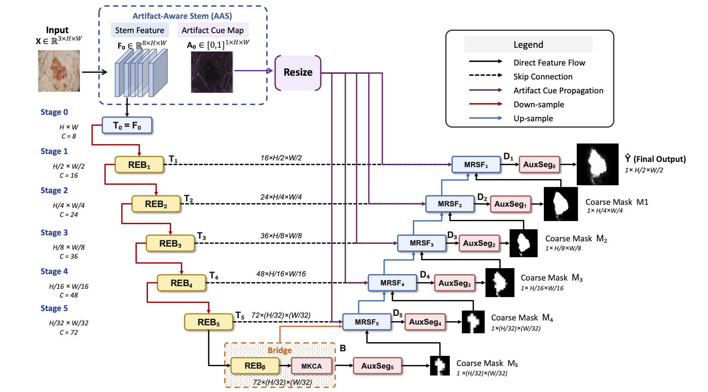
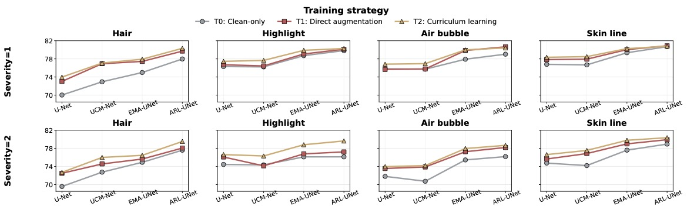

# Artifact-Robust Lightweight UNet with Explicit Artifact Modeling for Dermoscopic Image Segmentation

**Abstract**

Automated dermoscopic lesion segmentation is fundamental to computer-aided skin cancer diagnosis, yet lightweight networks deployed in resource-constrained settings remain vulnerable to common acquisition artifacts such as terminal hair, specular highlights, and air bubbles. Existing efficient U-Net variants optimize predominantly for parameter efficiency and clean-image accuracy, while robustness to artifact-corrupted images is rarely characterized. We propose **ARL-UNet**, an artifact-robust lightweight U-shaped network incorporating three complementary modules: an Artifact-Aware Stem that constructs a multi-cue artifact map; a Robust Encoder Block combining depthwise separable multi-scale convolution with channel gating; and a Mask-guided Robust Skip Fusion module that suppresses contaminated encoder features during decoding. To enable reproducible robustness evaluation, we construct a corrupted dermoscopic benchmark applying four clinically relevant artifact types at two severity levels to fixed ISIC validation splits, and conduct a systematic analysis of direct artifact augmentation and curriculum-based training strategies. Experiments show that ARL-UNet trained on clean images alone exhibits strong zero-shot robustness, and further gains are achieved with artifact augmentation and curriculum training, consistently surpassing state-of-the-art lightweight baselines in both clean-image accuracy and corrupted-image robustness. Our code is available at GitHub.




## Preparation

1.  **Environment Setup:**
    Create the conda environment using the provided file:
    ```bash
    git clone ${GitHub_Repo}
    pip install -r requirements.txt
    ```
    
2.  **DataSet:**
    The ISIC17 and ISIC18 datasets, divided into a 7:3 ratio, can be found here [Baidu](https://pan.baidu.com/s/1Y0YupaH21yDN5uldl7IcZA?pwd=dybm) or [GoogleDrive](https://drive.google.com/file/d/1XM10fmAXndVLtXWOt5G0puYSQyI2veWy/view?usp=sharing).

    Download the **ISIC2017 and ISIC2018** dataset and ensure the directory structure is organized as follows:
    ```bash
    data/
    ├── isic2017/
    │   ├── images/
    │   │   ├── *.png
    │   │   ├── *.png
    │   │   └── ...
    │   └── masks/
    │       ├── *.png
    │       ├── *.png
    │       └── ...
    └── isic2018/
        ├── images/
        │   ├── *.jpg
        │   ├── *.jpg
        │   └── ...
        └── masks/
            ├── *.png
            ├── *.png
            └── ...
    ```   


### Generate Benchmark

```bash
python tools/build_artifact_benchmark.py \
  --dataset data/isic2017 \
  --output data/isic2017_artifact_benchmark \
  --artifacts hair air_bubble skin_line highlight \
  --severities 1 2 \
  --seed 2026
```

```bash
python tools/build_artifact_benchmark.py \
  --dataset data/isic2018 \
  --output data/isic2018_artifact_benchmark \
  --artifacts hair air_bubble skin_line highlight \
  --severities 1 2 \
  --seed 2026
```


The current main benchmark uses `hair`, `air_bubble`, `skin_line`, and `highlight`. The legacy `black_frame` and `low_contrast` artifacts are no longer used for the main evaluation. After regenerating the benchmark, old CSV files should not be compared together with the new schema.
## Run

Train **ARL-UNet**. The channel list is defined by `arl_c_list` in `configs/config_setting.py`.

```bash
python train.py \
  --datasets isic17 \
  --network arl_unet \
  --train_data_mode clean \
  --artifact_val_benchmark data/isic2017_artifact_benchmark
```

```bash
python train.py \
  --datasets isic18 \
  --network arl_unet \
  --train_data_mode clean \
  --artifact_val_benchmark data/isic2018_artifact_benchmark
```


Robust training with `direct_aug`:

```bash
python train.py --datasets isic18 \
  --network arl_unet \
  --train_data_mode direct_aug \
  --artifact_val_benchmark data/isic2018_artifact_benchmark \
```

Curriculum training:

```bash
python train.py \
  --datasets isic18 \
  --network arl_unet \
  --train_data_mode curriculum \
  --artifact_val_benchmark data/isic2018_artifact_benchmark
```


Only the final training state is saved during training:

```text
checkpoints/latest.pth
```

If `--artifact_val_benchmark` is specified, the training logs record artifact validation metrics for clean, hair_s1/s2, air_bubble_s1/s2, skin_line_s1/s2, and highlight_s1/s2.

## Results




During evaluation, `--network` must match the network used during training.

```bash
python tools/evaluate_artifact_benchmark.py \
  --dataset isic17 \
  --benchmark data/isic2017_artifact_benchmark \
  --weights results/arl_unet_isic_17_clean/checkpoints/lastest.pth \
  --model_name "ARL-UNet + clean" \
  --network arl_unet \
  --output_dir results/_eval_isic17_arl_unet
```


```bash
python tools/evaluate_artifact_benchmark.py \
  --dataset isic18 \
  --benchmark data/isic2018_artifact_benchmark \
  --weights results/arl_unet_isic_18_clean/checkpoints/lastest.pth \
  --model_name "ARL-UNet + clean" \
  --network arl_unet \
  --output_dir results/_eval_isic18_arl_unet
```


`--robust_inference artifact_tta` does not require retraining. It generates lightweight restoration views based on hair, air_bubble, skin_line, and highlight cues, and fuses multi-view predictions with conservative weights only in regions where the artifact cue is high. The default setting is `--robust_inference none`, which performs the original single forward-pass evaluation.

<div align="center">

</div>
